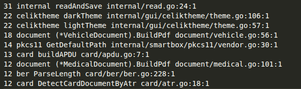

# Analiza koda korišćenjem gocyclo alata

## gocyclo

[Gocyclo](https://github.com/fzipp/gocyclo) izračunava
[ciklomatičku kompleksnost](https://en.wikipedia.org/wiki/Cyclomatic_complexity)
funkcija u `Go` izvornom kodu.

Ciklomatička kompleksnost je metrika kvaliteta koda
koja može da se koristi za identifikaciju dela koda kojima je potrebno
refaktorisanje. Meri broj linearno nezavisnih putanja kroz izvorni kod
funkcije.

Ciklomatička kompleksnost funkcije računa se prema sledećim pravilima:

```
 1 is the base complexity of a function
+1 for each 'if', 'for', 'case', '&&' or '||'
```

Funkcija sa većom ciklomatičkom kompleksnošću zahteva više testova kako bi se
pokrile sve moguće putanje i potencijalno je teža za razumevanje. Kompleksnost se može smanjiti primenom uobičajenih tehnika refaktorisanja koje
vode ka manjim funkcijama.

## Primena alata i rezultati

Alat `gocyclo` primenjen je na projekat sledećom komadom:

```
gocyclo -over 10 . -ignore "_test|Godeps|vendor/"
```

Primenjeni su flagovi:

- `over 10` - prikazuju se samo funkcije koje imaju ciklomatičnu složenost veću od 10
- `ignore "_test|Godeps|vendor/"` - ignorišu se testovi kao i Godeps i vendor

Rezultati se mogu videti na sledećoj slici:



Vidimo da postoji par funkcija sa veoma visokom ciklomatičnom složenošću.

## Analiza rezultata

U nastavku su funkcije sa najvećom ciklomatičkom složenošću (iz izlaza `gocyclo -over 10`), uz kratak razlog visokog skora:

- **internal/read.go** `readAndSave` — složenost 31; mnoštvo grananja za različite tokove čitanja i obradu grešaka.
- **internal/gui/celiktheme/theme.go** `lightTheme` — složenost 22; veliki `switch` sa više boja.
- **internal/gui/celiktheme/theme.go** `darkTheme` — složenost 22; veliki `switch` sa više boja.
- **document/vehicle.go** `(*VehicleDocument).BuildPdf` — složenost 18; brojna uslovna dodavanja sadržaja u PDF.
- **internal/smartbox/pkcs11/vendor.go** `GetDefaultPath` — složenost 14; kombinacija OS grana i raznih vendora.
- **card/apdu.go** `buildAPDU` — složenost 13; više uslovnih puteva pri sastavljanju APDU komandi.
- **document/medical.go** `(*MedicalDocument).BuildPdf` — složenost 12; različite sekcije i opcione grane pri generisanju PDF-a.
- **card/ber/ber.go** `ParseLength` — složenost 12; više grana za različite formate dužine u BER kodiranju.
- **card/atr.go** `DetectCardDocumentByAtr` — složenost 12; niz uslova za prepoznavanje kartice na osnovu ATR vrednosti.

### Popravke

Sažetak primenjenih popravki:

- **document/medical.go**: uveden `putMedicalData` helper i korišćen postojeći `cell` kako bi se eliminisalo ponavljanje ispisa label/data sa wrap-om.
- **document/vehicle.go**: uvedeni zajednički helperi `putUnderline`, `cell` i `putParagraph` pa je `BuildPdf` očišćen od dupliranog koda (underline, paragraf, cell).
- **internal/gui/celiktheme/theme.go**: boje prebačene u mape `lightColors`/`darkColors` sa zajedničkim `defaultColor`; `lightTheme` i `darkTheme` sada rade lookup sa fallback-om.
- **internal/read.go**: izdvojeni `checkFile`, `writeFileIfNotEmpty` i `checkReaders` radi jasnijeg toka (provere fajlova, uslovno generisanje/upis, rad sa reader-ima).

Preostale funkcije sa povišenom ciklomatičkom složenošću odnose se na obradu pametnih kartica i implementaciju standardizovanih protokola (ATR detekcija, BER parsiranje, APDU formiranje).

U ovim slučajevima veći broj grananja je neophodan kako bi se eksplicitno obradili svi definisani specijalni slučajevi protokola. Dalje razlaganje funkcija bi smanjilo čitljivost i otežalo verifikaciju korektnosti, bez realnog smanjenja logičke složenosti.
