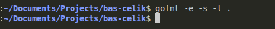

# Analiza koda korišćenjem gofmt alata

## gofmt

[**gofmt**](https://pkg.go.dev/cmd/gofmt) je alat za automatsko formatiranje Go programskog koda, ugrađen u sam Go toolchain. Vođen je stavom da postoji samo jedan ispravan način za formatiranje Go koda.

`gofmt` koristi **tab** karaktere za uvlačenje i **razmake** za poravnanja. Poravnanje podrazumeva da editor koristi font sa fiksnom širinom karaktera.

Bez navođenja putanje, `gofmt` obrađuje standardni ulaz. Kada je prosleđen fajl, obrađuje se taj fajl, a kada je prosleđen direktorijum, obrađuju se svi fajlovi sa ekstenzijom `.go` u tom direktorijumu rekurzivno (fajlovi čije ime počinje tačkom se ignorišu). Podrazumevano, `gofmt` ispisuje formatirani kod na standardni izlaz.

### Korišćenje

    gofmt [flags] [path ...]

### Podržani flagovi

#### -d

Ne ispisuje kompletan formatirani kod na standardni izlaz.
Ako se formatiranje fajla razlikuje od `gofmt` standarda, na standardni izlaz se ispisuje razlika (diff) između originalnog i formatiranog koda.

#### -e

Ispisuje sve greške, uključujući i one koje bi inače bile ignorisane ili smatrane sporednim.

#### -l

Ne ispisuje formatirani kod.
Ako se formatiranje fajla razlikuje od `gofmt` standarda, ispisuje se samo ime fajla.

#### -r rule

Primenjuje pravilo prepisivanja (rewrite rule) na izvorni kod pre formatiranja.

Primer:

    gofmt -r 'a[b:len(a)] -> a[b:]' -w file.go

#### -s

Pokušava da pojednostavi kod nakon primene rewrite pravila (ako postoji).

#### -w

Ne ispisuje formatirani kod na standardni izlaz.
Ako se formatiranje razlikuje, fajl se direktno prepisuje formatiranom verzijom.
U slučaju greške tokom upisa, originalni fajl se automatski vraća iz rezervne kopije.

## Primena alata i rezultati

Alat `gofmt` je pokrenut nad projektnim kodom sa sledećim flagovima:

- `-e` — ispis svih grešaka, uključujući i one koje se inače ne prikazuju
- `-s` — pokušaj pojednostavljenja koda primenom idiomatskih Go pravila
- `-l` — ispis samo naziva fajlova čije formatiranje odstupa od `gofmt` standarda

Cilj izvršavanja alata je identifikovanje fajlova koji odstupaju od propisanog formata. Rezultati izvršavanja prikazani su na narednoj slici.

## Analiza rezultata

Kako je jedan od osnovnih uslova za doprinos projektu striktno poštovanje formatiranja pomoću alata `gofmt`, očekivano je da tokom analize nije identifikovan nijedan fajl koji odstupa od propisanog formata. Izostanak izlaza alata ukazuje na to da je kompletan izvorni kod već usklađen sa zvaničnim Go konvencijama formatiranja.

Ovakav rezultat potvrđuje doslednu primenu standarda u okviru projekta, kao i dobru praksu održavanja koda. Pravilno formatiran kod doprinosi boljoj čitljivosti, lakšem održavanju i smanjenju mogućnosti za greške nastale usled neujednačenog stila pisanja.

Na osnovu dobijenih rezultata može se zaključiti da je analizirani kod uredno strukturiran i u potpunosti spreman za dalji razvoj i saradnju u timskom okruženju.
