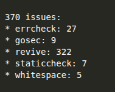
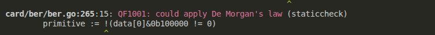
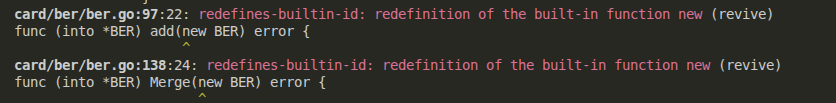

# Analiza koda korišćenjem golangci-lint alata

## Golangci-lint

[**Golangci-lint**](https://golangci-lint.run/) je alat za statičku analizu Go koda koji objedinjuje više različitih lintera u jedinstven okvir. Omogućava istovremenu proveru stila programiranja, semantičke ispravnosti i potencijalnih bezbednosnih problema, čime doprinosi kvalitetu, čitljivosti i pouzdanosti softverskog sistema.

## Primena alata i rezultati

Alat je primenjen nad analiziranim Go projektom koristeći unapred definisanu konfiguraciju lintera (`.golangci.yml`). Korišćeni linteri su:

- **revive** – proverava usklađenost koda sa stilskim konvencijama i dobrim praksama Go jezika, uključujući imenovanje, komentare i strukturu koda
- **whitespace** – detektuje nepravilnosti u razmacima i rasporedu praznih linija u izvornom kodu
- **govet** – analizira Go kod i detektuje sumnjive konstrukcije koje mogu dovesti do semantičkih grešaka
- **staticcheck** – identifikuje potencijalne bagove, loše obrasce i neefikasan kod
- **errcheck** – detektuje neproverene povratne vrednosti funkcija koje vraćaju grešku
- **ineffassign** – otkriva dodele promenljivih čije se vrednosti nikada ne koriste
- **unused** – identifikuje neiskorišćene promenljive, konstante, funkcije i tipove
- **bodyclose** – proverava da li je HTTP odgovor pravilno zatvoren kako bi se izbeglo curenje resursa
- **gosec** – identifikuje potencijalne bezbednosne ranjivosti u Go kodu, kao što su nesigurne kriptografske operacije ili nebezbedno rukovanje podacima

Rezultati izvršavanja alata prikazani su na sledećoj slici:

Neki od interesantnijih primera grešaka:

- `staticcheck` je predložio primenu De-Morganovog zakona na izraz sa negacijom ispred zagrade. Ovo je primer kako linter može pomoći u pojednostavljivanju logičkih izraza.
  

- `revive` je upozorio da se u funkcijama `add` i `Merge` predefiniše ugrađena funkcija `new`. Iako Go dozvoljava ovu predefiniciju, linter upozorava na potencijalnu konfuziju.
  

## Analiza rezultata

Većina upozorenja potiče od lintera `revive` (322), koji proverava imenovanje, dokumentacione komentare i strukturu koda.

Linter `errcheck` prijavio je 27 grešaka vezanih za neproveravanje povratne vrednosti funkcija koje vraćaju grešku. U nekim slučajevima bilo je preporučljivo proveriti povratnu vrednost funkcije, dok u funkcijama koje se izvršavaju kroz defer to nije bilo neophodno, jer greška ne utiče na tok programa.

Linter `gosec` je prijavio 9 potencijalnih problema, uključujući konverziju iz `int` u `uint32` koja može dovesti do prekoračenja. Kod je izmenjen kako bi se zadovoljili zahtevi lintera, iako u analiziranim slučajevima prekoračenje nije bilo moguće.

Linter `staticcheck` prijavio je 7 grešaka i predložio zamenu uzastopnih `if-else` izraza sa `switch` konstrukcijom radi preglednijeg koda.

Linter `whitespace` prijavio je 5 grešaka, sugerišući uklanjanje nepotrebnih praznih linija.

Na osnovu rezultata primene alata, nisu pronađene greške koje bi mogle uticati na izvršavanje programa, što potvrđuje da je kod projekta kvalitetan i dobro strukturisan.

Nakon ispravki u kodu, preostalo je ukupno 24 greške: 13 od `revive` i 11 od `errcheck`. Greške `revive` se odnose na imenovanje promenljivih i ponavljanje reči (stuttering), npr. `reader.ReaderPoller`, kao i na raspored parametara funkcija. Greške `errcheck` odnose se na neproveravanje povratne vrednosti kod funkcija koje su `defer`-ovane, što nije problematično i nije bilo potrebno ispravljati.

## Zaključak

Primena alata `golangci-lint` potvrđuje da je kod projekta **dobro strukturisan, čitljiv i u skladu sa stilskim i semantičkim standardima Go jezika**. Iako su pronađene određene greške one nisu značajno uticale na kvalitet koda i izvršavanje programa. Većina prijavljenih grešaka potiče od lintera `revive`. Te greške ne utiču na funkcionalnost programa, ali poboljšavaju upotrebljivost i čitljivost programa što je naročito korisno u timskom radu jer podstiče dokumentovanost i konzistentno imenovanje promenljivih.
