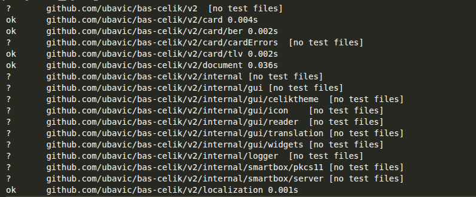
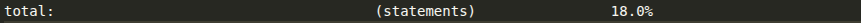
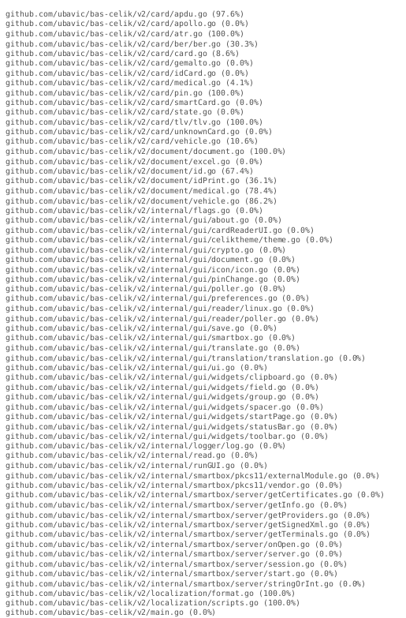
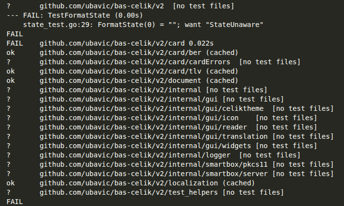
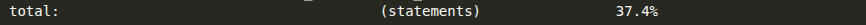
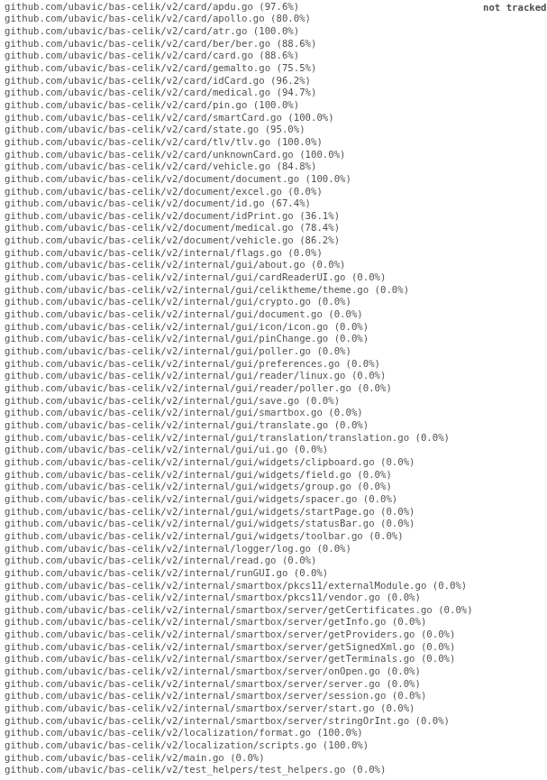

# Unit testovi korišćenjem go test i go tool cover alata

## Go test

[Go test](https://pkg.go.dev/cmd/go/internal/test) omogućava automatsko izvršavanje testova paketa korišćenjem import paths.
Ispisuje sumirane rezultate testova u sledećem formatu:

```
ok archive/tar 0.011s
FAIL archive/zip 0.022s
ok compress/gzip 0.033s
...
```

praćeno detaljnim izlazom za svaki od paketa.

`Go test` kompajlira svaki paket zajedno sa fajlovima čiji naziv zadovoljava šablon `*_test.go`.

Ovi dodatni fajlovi mogu sadržati test funkcije, benchmark funkcije, fuzz testove i primer funkcija. Pogledajte `go help testfunc` za više informacija.  
Svaki navedeni paket uzrokuje izvršavanje posebnog test binarnog fajla.  
Fajlovi čiji nazivi počinju sa "\_" (uključujući `_test.go`) ili "." se ignorišu.

Test fajlovi koji deklarišu paket sa sufiksom `_test` biće kompajlirani kao poseban paket, a zatim povezani i izvršeni sa glavnim test binarnim fajlom.

Go alat će ignorisati direktorijum nazvan `testdata`, što ga čini dostupnim za smeštanje pomoćnih podataka potrebnih za testove.

## Go tool cover

[Cover](https://pkg.go.dev/cmd/cover) je program za analizu profila pokrivenosti (coverage) koji se generišu pomoću `go test -coverprofile=cover.out`.

## Primena alata i rezultati

S obzirom na to da projekat već sadrži određeni broj **unit testova**, alati su prvo primenjeni bez izmena i dodavanja novih testova.

`Go test` je primenjen na svim fajlovima u projektu, prvo bez dodatnih flagova, a zatim sa `-v` (verbose) i `-coverprofile` flagovima, kako bi se videlo izvršavanje svakog testa ponaosob i kako bismo generisali **coverage po linijama koda**. Iz izlaza se vidi da svi testovi prolaze, što je i očekivano.



`Go tool cover` primenjen na `cover.out` fajlu koji smo dobili iz `go test` komande pokazuje da je **ukupna pokrivenost koda po linijama** 18%.



Pokrivenost po fajlovima ponaosob može se videti na sledećoj slici:



Detaljnu pokrivenost po linijama koda možemo videti u izlaznom [HTML fajlu](./cover_before.html)

## Analiza rezultata

Svi unit testovi u projektu su uspešno prošli, što potvrđuje da trenutni testovi ne detektuju greške u delovima koda koje pokrivaju.

Međutim, ukupna pokrivenost testovima je relativno niska – svega 18% linija koda je pokriveno testovima. To znači da **većina koda nije direktno testirana**, što ostavlja prostor za eventualne greške ili regresije u neproverenim delovima projekta.

Pokrivenost po fajlovima pokazuje da su određeni moduli i funkcionalnosti gotovo u potpunosti testirani, dok su drugi gotovo potpuno nezaštićeni testovima. Ovo ukazuje na moguće prioritete za dodatno pisanje unit testova, naročito za kritične funkcije i module koji imaju veliki uticaj na funkcionalnost i stabilnost aplikacije.

Korišćenjem `go tool cover -html=cover.out` možemo vizuelno identifikovati delove koda koji nisu pokriveni testovima, što olakšava planiranje dodatnih testova i povećanje ukupne pokrivenosti. Povećanje coverage-a ne samo da smanjuje rizik od grešaka, već i poboljšava kvalitet i održivost koda u budućnosti.

## Dodati testovi

Paket `card` odabran je za pisanje dodatnih unit testova jer sadrži važne funkcionalsti vezane za čitanje elektronskih kartica.

### Test helpers i card mock

Korišćenjem paketa `testify/mock` kreirana je CardMock struktura koja omogućava da izolujemo kod koji obrađuje karticu kako bi napravili testove jedinica koda. Nasleđivanje strukture `Mock` iz paketa `testify/mock` daje nam moguđnost da određujemo povratnu vrednost funkcije na osnovu ulaza, da proveravamo da li je funkcija bila pozvana potreban broj puta i slično. Ovo u velikoj meri olakšava pisanje unit testova. Detaljna implementacija može se videti u fajlu `/unit/test_helpers/test_helpers.go`.

### Testovi

/unit/card/apollo_test.go:

- Test_InitCard - proverava da inicijalizacija Apollo kartice ne vraća grešku.
- TestApolloReadCard - simulira čitanje svih fajlova sa mock smart kartice i validira rezultate i greške.
- TestApolloSelectFile - ispituje select APDU, pozitivne i negativne statuse/greške Transmit poziva.
- TestApolloReadFile - pokriva čitanje fajla u delovima, bad header, greške čitanja i prazan chunk.
- TestApolloAtr - potvrđuje da `Atr()` vraća očekivani ATR.
- TestApolloGetDocumentError - očekuje grešku kada nedostaju učitani fajlovi pre parsiranja dokumenta.
- TestApolloTest - očekuje da self-test funkcija vraća true.

/unit/card/card_test.go:

- Test_responseOK - proverava da li status bajtovi označavaju uspeh.
- Test_read - validira čitanje binarnog fajla: korektne APDU vrednosti, kraćenje dužine i razne greške.
- Test_trim4b - testira odsecanje leading 4 bajta kada je potrebno.
- Test_DetectCardDocument - pokriva mapiranje ATR-a na tip kartice, uključujući status greške i unknown karticu.

/unit/card/gemalto_test.go:

- TestGemaltoInitCard - obuhvata sve grane inicijalizacije (tri pokušaja appleta i različite greške Transmit poziva).
- TestGemaltoReadCard - simulira čitanje dokumenata, ličnih, prebivališnih i foto fajlova sa očekivanim greškama.
- TestGemaltoGetDocument - proverava parsiranje TLV podataka u IdDocument i greške po fajlu.
- TestGemaltoAtr - potvrđuje da `Atr()` vraća postavljeni ATR.
- TestGemaltoReadFile - testira selektovanje fajla, čitanje zaglavlja/tela i scenarije loših statusa.
- TestGemaltoReadCertificateFile - validira čitanje sertifikata u segmentima i greške header/body/selektovanja.
- TestGemaltoInitCrypto - očekuje uspešnu inicijalizaciju kriptografije (SELECT AID).
- TestGemaltoChangePinSuccess - proverava tok promene PIN-a uz transakciju i vraćene pokušaje.
- TestGemaltoChangePinInvalidNew - validira odbacivanje neispravnog novog PIN-a.
- TestGemaltoReadSignatures - čita dve potpisa iz fajlova sa header+body segmentima.
- TestGemaltoLoadCertificates_Existing - čuva prethodno učitane sertifikate bez dodatnih Transmit poziva.
- TestGemaltoGetCertificates - vraća kopiju validnih sertifikata filtrirajući nil vrednosti.

/unit/card/medical_test.go:

- Test_descramble - dekodira UTF-16 polja i proverava očekivane stringove i prazne slučajeve.
- TestMedicalInitCard - gradi očekivani AID select APDU i pokriva uspeh/bad status/grešku transmitovanja.
- TestMedicalReadCard - čita četiri medicinska fajla, validira uspeh i greške na svakom koraku.
- TestMedicalGetDocument - parsira TLV zapise u MedicalDocument (muški/ženski) i pokriva sve parse greške.

/unit/card/smartCard_test.go:

- TestMakeVirtualCard - proverava konstrukciju virtualne kartice i mapiranje fajlova.
- TestVirtualCard_Status - validira Status izlaz (ATR, Reader, State).
- TestTransmit - očekuje podrazumevani uspešan odgovor na Transmit.

/unit/card/state_test.go:

- TestFormatState - formatira SCARD flagove pojedinačno i u kombinaciji u string.

/unit/card/unknownCard_test.go:

- TestAtr - validira vraćeni ATR.
- TestReadFile - očekuje grešku „not implemented”.
- TestInitCard - proverava da inicijalizacija prolazi bez greške.
- TestReadCard - očekuje da ReadCard ne vraća grešku.
- TestGetDocument - očekuje nil dokument bez greške.
- TestTest - očekuje true iz self-test funkcije.

/unit/card/vehicle_test.go:

- Test_parseVehicleCardFileSize - proverava parsiranje dužine/ofseta za različite header kombinacije i greške.
- TestVehicleCardReadCard - simulira čitanje četiri vozila fajla sa validacijom i grešnim slučajevima po fazi.
- TestVehicleCardGetDocument - BER-dekodira minimalne fajlove i mapira u VehicleDocument.

/unit/card/ber/ber_test.go:

- Test_parseBerLength - pokriva različite formate dužine i greške.
- Test_parseBerTag - proverava parsiranje taga, primitivni/konstruisani bit i greške.
- TestParseBER - gradi BER stablo iz bajt niza i proverava greške praznog ulaza.
- Test_parseBERLayer - testira parsiranje sloja u primitive/construct podslojeve i error slučajeve.
- TestBERAccess - pristupa deci prema adresi i proverava grešku za nepostojeći put.
- TestBERAdd - dodaje i spaja čvorove, validira tipove i detektuje greške.
- TestBERMerge - spaja BER stabla i hvata mismatch tagova.
- TestAssignFromAndString - dodeljuje vrednost putem adrese i proverava string prikaz stabla.

## Rezultati nakon dodavanja testova

Nakon dodavanja navedenih unit testova `go test` i `go tool cover` pokrenuti su na isti način.
Izlaz komande `go test` bez dodatnih falgova vidimo na narednoj slici:



U ovo slučaju vidimo da jedan test pada.

`Go tool cover` primenjen na `cover.out` fajlu koji smo dobili iz `go test` komande pokazuje da je **ukupna pokrivenost koda po linijama** sada 34%.



Odnosno po svim fajlovima ponaosob:



Detaljnu pokrivenost po linijama koda možemo videti u izlaznom [HTML fajlu](./cover_after.html)

## Analiza rezultata dodatih testova

Jedan test je pao. U pitanju je TestFormatState koji proverava prevođenje binarnih SCARD flagova u čitljive poruke. Razlog pada ovog testa je slučaj scard.StateUnaware koji ima binarnu vrednost sa svim nulama i kada se primeni bitovski AND operator rezultat je `false`, iako očekujemo da bude `true`. Razlog je najverovatnije u tome što je ovaj poseban slučaj tretiran isto kao i ostali, iako je suštinski različit i zahteva zasebnu obradu.

Kod je ranije glasio:

```
if state&scard.StateUnaware != 0 // 0&0 == 0
```

Jednostavnom izmenom u:

```
if state == 0 && state&scard.StateUnaware == 0
```

problem se rešava i test prolazi.

Ovo ukazuje na to da iako kod na prvi pogled deluje ispravno, jednostavnim unit testovima je lako pronaći nedostatke u programu.
