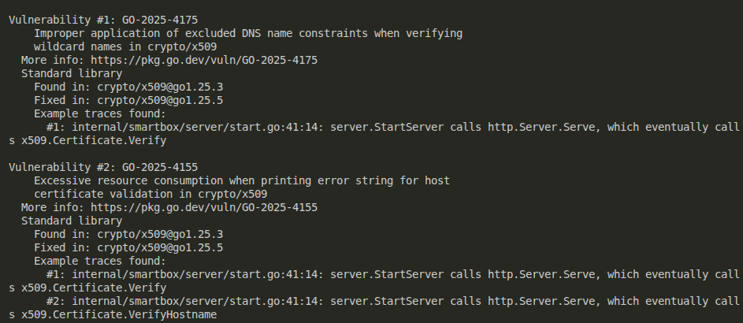
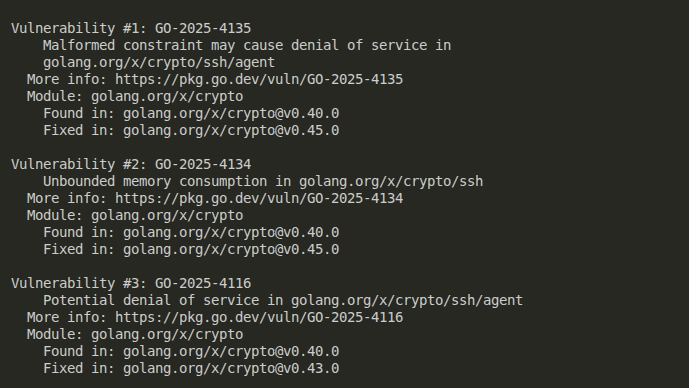

# Analiza koda korišćenjem govulncheck alata

## Govulncheck

[**Govulncheck**](https://pkg.go.dev/golang.org/x/vuln/cmd/govulncheck) je alat iz Go toolchaina koji se koristi za pronalaženje poznatih ranjivosti u korišćenim Go paketima. Alat koristi statičku analizu koda i prijavljuje samo one ranjivosti koje mogu imati uticaj na samu aplikaciju.

Podrazumevano, `govulncheck` šalje zahteve bazi podataka poznatih Go ranjivosti na adresi [https://vuln.go.dev](https://vuln.go.dev). Zahtevi sadrže **samo putanje modula sa poznatim ranjivostima**, bez deljenja izvornog koda ili drugih osobina programa.

Ako želimo da koristimo drugačiju bazu podataka, koristi se flag `-db`. Baza podataka mora biti u skladu sa specifikacijom: [Go Vulnerability Database](https://go.dev/security/vuln/database).

`Govulncheck` koristi verziju Go-a za koju je konfigurisan modul ili binarni fajl:

- **Za analizu izvornog koda**: koristi se verzija Go komande koja je dostupna na `PATH`.
- **Za analizu binarnih fajlova**: koristi se verzija Go koja je korišćena prilikom kompilacije.

Pokretanje `govulncheck` radi se iz direktorijuma modula, koristeći istu sintaksu putanje paketa kao i `go` komanda:

    cd my-module
    govulncheck ./...

> **NAPOMENA:** Alat `govulncheck` se oslanja na [Go Vulnerability Database](https://vuln.go.dev/) koja u trenutku izvršavanja skripte može biti ažurirana i zbog toga može dati drugačije rezultate od prikazanih. Moguće je da se u trenutku ponovnog izvršavanja analize identifikuju dodatne ranjivosti ili da se postojeće klasifikuju drugačije.

## Primena alata i rezultati

Alat je pokrenut nad svim fajlovima projekta. Pronađene su sledeće ranjivosti:

- **Standardna biblioteka Go: 2 ranjivosti**

  - GO-2025-4175 – nepravilna primena DNS name constraints u `crypto/x509`  
    [više informacija](https://pkg.go.dev/vuln/GO-2025-4175)  
    Rešeno nadogradnjom na Go verziju 1.25.5
  - GO-2025-4155 – prekomerna potrošnja resursa pri proveri host sertifikata u `crypto/x509`  
    [više informacija](https://pkg.go.dev/vuln/GO-2025-4155)

  

- **Moduli: 3 ranjivosti**

  - GO-2025-4135 – neispravno definisana ograničenja u `golang.org/x/crypto/ssh/agent`
  - GO-2025-4134 – neograničeno korišćenje memorije u `golang.org/x/crypto/ssh`
  - GO-2025-4116 – potencijalni DoS u `golang.org/x/crypto/ssh/agent`

  

Preostale ranjivosti nisu direktno korišćene u kodu i ne utiču na trenutnu funkcionalnost aplikacije.

## Analiza rezultata

`Govulncheck` je skenirao 36 modula projekta i Go standardnu biblioteku verzije 1.25.3. Analiza je pokazala da su identifikovane ranjivosti u standardnoj biblioteci i modulima `golang.org/x/crypto`. Ove ranjivosti mogu predstavljati sigurnosni rizik.

- Za standardnu biblioteku: nadogradnja Go verzije u `go.mod` sa `go 1.24.2` na `go 1.25.5` i izvršavanje komande:

```
go mod tidy
```

- Za popravku ranjivosti u modulima `golang.org/x/crypto` primenjene su sledeće komande:

```
  go get golang.org/x/crypto@v0.45.0
  go mod tidy
```

Nakon primene ovih koraka, sve identifikovane ranjivosti su otklonjene, čime je kod sada u skladu sa preporukama sigurnosne zajednice Go-a.

Analiza korišćenjem alata `govulncheck` pokazala je da su postojale poznate ranjivosti u standardnoj biblioteci Go i u nekim korišćenim modulima. Nakon nadogradnje Go verzije i kritičnih modula, sve identifikovane ranjivosti su otklonjene.
